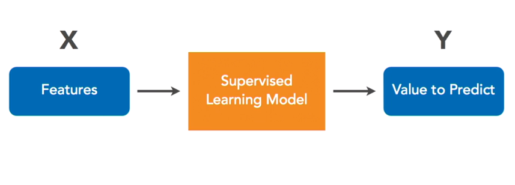

## Chapter 3

#### Working with Data

* Use Pandas library to populate data and view in web browser.
* Analyze the data and see what data attributes will be useful.

For example, Using [ml_house_data_set.csv](ml_house_data_set.csv)
The dataset has 19 fields for each house. The first 18 fields describe the house itself. They tell us how large it is, where it's located, and so on. These 18 fields are called features.

List of |  18 Dataset attributes |
--- | --- |
year_built | stories |
full_bathrooms | half_bathrooms |
livable_sqft | total_sqft |
garage_type | garage_sqft |
carport_sqft | has_fireplace |
has_pool | has_central_heating |
has_central_cooling | house_number |
street_name | unit_number
city | zip_code
num_bedrooms |

* Last field (19th field) **sale_price** is special. As that's the value we are trying to predict.

#### Naming Conventions

#### How much data does machine learning need?

* Data should cover as many combinations of features as possible
  *  For example, we want our home price dataset to include prices for big houses with lots of bathrooms and no garage and no pool, but also big houses with lots of bathrooms and no garage but with a pool.
  *  The more combinations that are represented, the better the model can do at capturing how each of these attributes affects the house's final price.
* You should aim for at least 10x more data points than the number of features
  *  For example, We have 18 features in our housing dataset so we'd want a bare minimum of 180 houses to work with.
* More data is almost always better (but not always necessary).

