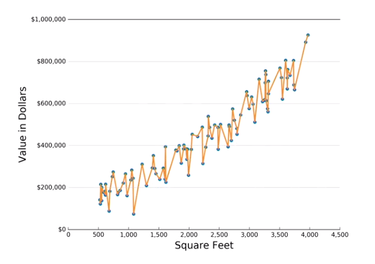
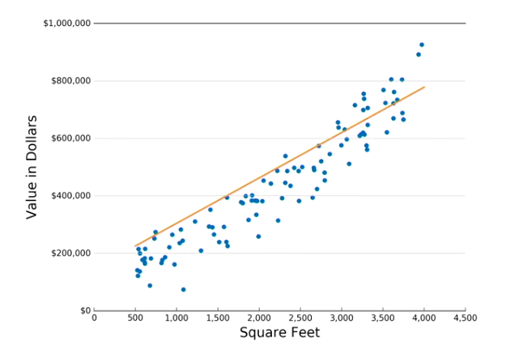

## Chapter 6

#### Overfitting and underfitting

* A key challenge when building machine learning models is learning how to deal with underfitting and overfitting

**Overfitting**

* Overfitting is when your model memorizes your exact training data, but doesn't actually figure out the pattern in the data.



* In other words, the model fits the training data too much. It will make bad predictions for any house that wasn't in the training data set.

**Underfitting**

* Opposite of Overfitting
*  It's when your model is too simple, and doesn't fully learn the pattern in the data.



* Underfitting can happen because the model you are using just isn't complex enough to match the training data.
* In this case, our model is just a straight line. No straight line will ever be able to follow the curve in these house prices accurately.

***

* You can indirectly tell if your model is overfitting or underfitting based on the training set and test set error rates.

#### Overfitting
* Training set error very low
* Test set error very high

* You can make your gradient boosting model less complex by using fewer decision trees, making each decision tree smaller, or by preferring simple decision trees over complex ones

#### Underfitting
* Training set error very high
* Test set error very high

**Solution**: more complex model

#### Good Fit
* Training set error low
* Test set error low

* By tuning the hyper parameters of the model, we can fix underfitting and overfitting issues, and end up with a model that fits well.

***

* In our case, we have six different parameters. Meaning, we have almost infinite number of combinations to try.
```python
model = ensemble.GradientBoostingRegressor(
    n_estimators = 1000,
    learning_rate = 0.1,
    max_depth = 6,
    min_samples_leaf = 9,
    max_features = 0.1,
    loss='huber'
)
```

* To solve this, we can use **grid search**.
* A grid search is where you list out a range of settings you want to try for each parameter, and you literally try them all.


